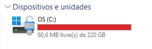

🚂 **Terraformeiros de plantão**, se vocês são como eu, que vão trabalhando em vários projetos e nunca limpam as pastas, fiz um script pra ajudar a recuperar um espaço que os providers dos projetos ocupam!

Antes de rodar o script, este era o espaço presente na máquina da firma:



Depois de rodar o script em um diretório de testes:


Resultado:


 

Agora rodei nos meus documentos, onde normalmente baixo os terraforms e organizo minhas coisas:


 

# <font color="#008000">Liberado +22Gb de espaço!</font>


### O Script:

```Powershell
param (
    [string]$Caminho
)

if (-Not (Test-Path $Caminho)) {
    Write-Host "O caminho especificado não existe." -ForegroundColor Red
    exit 1
}

$pastasTerraform = Get-ChildItem -Path $Caminho -Recurse -Directory -Filter ".terraform"

foreach ($pasta in $pastasTerraform) {
    Get-ChildItem -Path $pasta.FullName -Force | Remove-Item -Recurse -Force
    Write-Host "Conteúdo de $($pasta.FullName) apagado." -ForegroundColor Green
}

Write-Host "Processo concluído." -ForegroundColor Cyan
```

---

Para rodar o script, basta habilitar a permissão de execução do powershell rodando este comando como administrador:
```Powershell
Set-ExecutionPolicy -ExecutionPolicy RemoteSigned -Scope CurrentUser
```

Só salvar em algum canto da sua máquina o script e rodar passando o caminho onde você quer realizar a limpeza:
 
```Powershell 
.\limpar-terraform.ps1 -Caminho "C:\temp"
```
